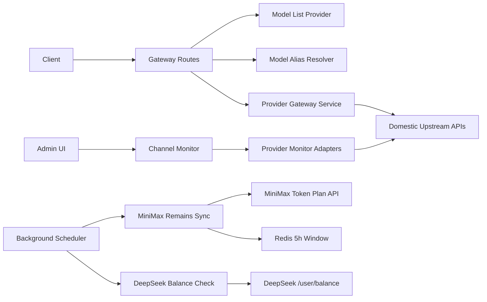

# 国产供应商网关第二阶段设计

编写日期：2026-05-08

## 1. 背景

当前 MiniMax、GLM、Kimi、DeepSeek 四个国产 AI 供应商已经接入，基础转发链路与初步测试通过。第一阶段重点解决“请求能转发、响应能回传、账单能按现有体系落库”。第二阶段需要把这些供应商纳入网关的完整运营能力：模型发现、渠道健康监控、供应商特有额度/余额健康检测，以及客户端兼容模型 alias。

本设计文档基于现有文档与代码现状整理，目标是作为第二阶段实现的产品与技术规格。

## 2. 目标

1. 对外提供统一的 `GET /v1/models` 能力，四个国产供应商都能返回客户端可调用的模型清单。
2. 扩展 Channel Monitor，使其支持 MiniMax、GLM、Kimi、DeepSeek 的上游探测、延迟统计和健康状态展示。
3. 按供应商真实能力做健康/额度检测：
   - MiniMax：做官方 remains 定时同步，并用官方 5 小时窗口 remains 自动校准本地 Redis 窗口。
   - DeepSeek：做余额健康检测。
   - GLM/Kimi：只做通用健康监控，不构造伪 remains 或伪余额。
4. 提供兼容模型 alias，让 Claude/OpenAI/DeepSeek 常见客户端模型名可以按供应商能力映射到真实上游模型。
5. 保持现有计费、日志、账号、分组限制和模型映射机制兼容，不破坏第一阶段已通过的请求链路。

## 3. 非目标

1. 不在第二阶段实现 GLM/Kimi 的官方余额或 remains 能力，除非供应商后续提供稳定 API。
2. 不把余额/remains 作为每次请求前的强依赖远程检查，避免引入高延迟和供应商 API 抖动。
3. 不改变现有 request/usage 计费主流程，只补充 alias 记录字段与健康状态来源。
4. 不引入统一的“虚拟额度”概念来掩盖供应商差异。
5. 不在本阶段重构所有供应商网关，只抽取必要的 provider capability、model list、alias 和 monitor adapter 能力。

## 4. 现状与差距

### 4.1 MiniMax

已实现：

- `/v1/messages` 与 `/v1/chat/completions` 转发链路。
- 文本 5 小时窗口的 Redis 预占、回滚和请求后结算。
- 管理端手动同步 token plan remains 的接口。
- 前端模型白名单中已有 `MiniMax-M2.7`、`MiniMax-M2.7-highspeed`。

缺口：

- 网关路由对 MiniMax `GET /v1/models` 仍返回 unsupported。
- token plan remains 只有手动同步，没有后台定时同步。
- 官方 remains 与 Redis 本地窗口之间缺少自动校准。
- Channel Monitor provider 选项和后端校验还未支持 MiniMax。
- MiniMax alias 主要依赖账号模型映射，缺少平台默认兼容 alias。

### 4.2 GLM

已实现：

- `/v1/models` 已有基础支持，返回 `GLM-5.1`、`GLM-4.7`、`GLM-4.5-air` 等默认模型。
- 已存在部分 Claude prefix 到 GLM 模型的兼容映射。
- Anthropic/OpenAI 兼容请求链路已经接入。

缺口：

- Channel Monitor 未支持 GLM。
- alias 能力散落在账号模型解析逻辑中，缺少统一可测试的 resolver。
- 前端监控表单、筛选器、模板管理缺少 GLM provider。

### 4.3 Kimi

已实现：

- `/v1/models` 已有基础支持，默认返回 `kimi-for-coding`。
- Anthropic/OpenAI 兼容请求链路已经接入。

缺口：

- Channel Monitor 未支持 Kimi。
- 默认没有兼容 alias，需要为 Claude 兼容客户端提供可控映射。
- 前端监控表单、筛选器、模板管理缺少 Kimi provider。

### 4.4 DeepSeek

已实现：

- `/v1/models` 已有基础支持，返回 `deepseek-v4-flash`、`deepseek-v4-pro`。
- OpenAI/Anthropic 兼容请求链路已经接入。
- 上游错误处理已包含余额不足等错误语义。
- usage 中已解析 cached tokens。

缺口：

- Channel Monitor 未支持 DeepSeek。
- `/user/balance` 余额接口尚未纳入健康检测。
- 官方兼容 alias 如 `deepseek-chat`、`deepseek-reasoner` 尚未作为统一 alias 机制落地。
- reasoning tokens 的独立统计不是本阶段核心目标，可在后续账单增强中处理。

## 5. 设计原则

1. **真实能力优先**：只使用供应商真实提供的 remains、balance 或健康接口，不伪造不存在的额度字段。
2. **统一外观，差异化内部**：外部接口保持 `/v1/models`、Channel Monitor、alias resolver 的统一体验；内部按供应商 capability 分支。
3. **本地缓存不依赖单点远程调用**：模型清单与 alias 由本地配置、账号配置和默认 capability 生成，不在每次 `/v1/models` 请求中调用上游。
4. **健康检测不阻塞正常流量**：定时同步和 monitor 结果用于运营判断与账号调度提示，不作为所有请求的同步前置条件。
5. **可审计**：请求日志需要能区分用户请求模型、alias 命中来源、真实上游模型和计费模型。
6. **最小侵入**：优先复用现有 account、gateway handler、quota cache、monitor history 和前端管理页结构。

## 6. 供应商能力矩阵

| 供应商 | `GET /v1/models` | Channel Monitor | 额度/余额检测 | alias |
| --- | --- | --- | --- | --- |
| MiniMax | 新增完整支持 | 新增 | 官方 remains 定时同步 + Redis 5 小时窗口校准 | 新增默认兼容 alias，可被账号映射覆盖 |
| GLM | 已有，补齐统一入口和测试 | 新增 | 通用健康监控 | 统一现有 alias resolver |
| Kimi | 已有，补齐统一入口和测试 | 新增 | 通用健康监控 | 新增保守默认 alias，可配置关闭 |
| DeepSeek | 已有，补齐统一入口和测试 | 新增 | `/user/balance` 余额健康检测 | 新增 `deepseek-chat`、`deepseek-reasoner` 等官方兼容 alias |

## 7. 总体架构

第二阶段新增四个横向能力，挂接到现有网关和管理端模块。



核心模块：

1. `ProviderGatewayCapabilities`
   - 定义 provider 支持的协议、默认模型、alias、monitor probe、quota/balance 能力。
   - 作为后端校验、模型清单和监控适配器的单一事实来源。

2. `GatewayModelListProvider`
   - 根据 provider、账号、分组和模型映射生成请求侧模型清单。
   - 避免每次请求访问上游。

3. `ModelAliasResolver`
   - 输入：provider、requested model、账号模型映射、分组限制。
   - 输出：upstream model、billing model、alias source、是否允许。
   - 用于 `/v1/messages`、`/v1/chat/completions` 和后续新增协议。

4. `ChannelMonitorProviderAdapter`
   - 为每个 provider 构造最小探测请求、解析响应、归一化错误。
   - 复用现有 monitor result/history 存储。

5. `MiniMaxRemainsSyncService`
   - 定时拉取官方 remains。
   - 更新账号额外字段。
   - 调用 Redis 窗口校准接口。

6. `DeepSeekBalanceHealthService`
   - 定时或手动拉取 `/user/balance`。
   - 更新账号健康元数据和 monitor 结果。

## 8. `GET /v1/models` 设计

### 8.1 接口语义

`GET /v1/models` 用于让 OpenAI 兼容客户端发现“当前网关入口可接受的模型 ID”。它不代表供应商官方完整模型列表，也不应该实时依赖上游查询。

返回模型 ID 的来源按优先级合并：

1. 当前账号或渠道显式配置的模型映射 key。
2. 分组可用模型限制中的 request-facing 模型。
3. provider 默认 request-facing 模型。
4. 显式启用并配置为可展示的 alias。

对 wildcard alias，例如 `claude-sonnet-*`，不直接在 `/v1/models` 中返回通配符；只返回具体配置 key 或常用具体 alias。resolver 仍可接受 wildcard 命中的请求。

### 8.2 返回格式

保持 OpenAI 兼容格式：

```json
{
  "object": "list",
  "data": [
    {
      "id": "MiniMax-M2.7",
      "object": "model",
      "created": 0,
      "owned_by": "minimax"
    }
  ]
}
```

### 8.3 各 provider 默认模型

MiniMax：

- `MiniMax-M2.7`
- `MiniMax-M2.7-highspeed`

GLM：

- `GLM-5.1`
- `GLM-4.7`
- `GLM-4.5-air`

Kimi：

- `kimi-for-coding`

DeepSeek：

- `deepseek-v4-flash`
- `deepseek-v4-pro`

### 8.4 MiniMax 路由调整

当前 MiniMax `GET /v1/models` 返回 unsupported。第二阶段需要：

1. 在 gateway route 分发中放开 MiniMax models 路由。
2. 复用统一 `GatewayModelListProvider`。
3. 增加 MiniMax models handler/service 测试。
4. 保持 unsupported 提示只用于真正未实现的路径。

## 9. Channel Monitor 设计

### 9.1 作用

Channel Monitor 用于持续探测“账号/渠道到上游供应商”的健康情况，包括：

- API key 是否有效。
- 上游 endpoint 是否可达。
- 指定模型是否可调用。
- 响应延迟、错误码、错误类型。
- 最近一段时间可用率和失败趋势。

它面向运营和调度诊断，不等同于计费系统，也不承担每次请求前的同步鉴权。

### 9.2 Provider 扩展

后端 provider 校验从现有 `openai`、`anthropic`、`gemini` 扩展为：

- `openai`
- `anthropic`
- `gemini`
- `minimax`
- `glm`
- `kimi`
- `deepseek`

前端同步更新：

- Monitor 创建/编辑弹窗 provider 下拉。
- Monitor 列表筛选器。
- Monitor template 管理页。
- provider 展示文案和颜色标识。

### 9.3 探测请求策略

每个 provider 使用最小 token 的真实上游请求，默认 `max_tokens` 或等效字段设为 `1`，prompt 使用固定短文本，例如 `ping`。

MiniMax：

- 默认探测 Anthropic 兼容 messages 协议。
- 默认模型：`MiniMax-M2.7-highspeed`，失败时可配置为 `MiniMax-M2.7`。
- 成功条件：HTTP 2xx 且响应包含可解析的 message/content 或 usage。

GLM：

- 默认探测 Anthropic 兼容 messages 协议。
- 默认模型：`GLM-4.5-air` 或账号默认模型。
- 成功条件：HTTP 2xx 且响应结构可解析。

Kimi：

- 默认探测 Anthropic 兼容 messages 协议。
- 默认模型：`kimi-for-coding`。
- 成功条件：HTTP 2xx 且响应结构可解析。

DeepSeek：

- 默认探测 OpenAI 兼容 chat completions 协议。
- 默认模型：`deepseek-v4-flash`。
- 成功条件：HTTP 2xx 且响应包含 choices 或 usage。

### 9.4 错误归一化

Monitor 需要把上游错误归一成统一健康语义：

| 类型 | 示例 | 健康状态 |
| --- | --- | --- |
| authentication_failed | API key 无效、权限不足 | unhealthy |
| model_not_found | 模型不存在或账号未开通 | unhealthy |
| insufficient_balance | DeepSeek 余额不足、上游 402 | unhealthy |
| quota_exhausted | MiniMax remains 为 0 或窗口额度耗尽 | degraded/unhealthy |
| rate_limited | 上游限流 | degraded |
| upstream_timeout | 连接或读取超时 | degraded |
| upstream_5xx | 供应商服务错误 | degraded |
| parse_error | 响应结构不符合预期 | degraded |

Monitor 结果只写入监控历史和健康快照，不直接禁用账号。账号调度是否跳过 unhealthy 渠道可由现有策略或后续策略决定。

## 10. MiniMax remains 同步与 Redis 校准

### 10.1 背景

MiniMax 文本 token plan 是 5 小时窗口模型。现有 Redis 本地窗口只能统计通过本系统的请求；官方 remains 可以反映供应商侧真实剩余额度，包括后台变化、外部请求和供应商修正。因此第二阶段需要用官方 remains 定时校准本地 Redis 窗口。

### 10.2 同步频率

配置项：

- `gateway.minimax_remains.sync_enabled`：默认开启。
- `gateway.minimax_remains.sync_interval_seconds`：默认 300 秒。
- `gateway.minimax_remains.sync_jitter_seconds`：默认 30 秒，避免多个实例同时请求。
- `gateway.minimax_remains.batch_size`：默认 50。
- `gateway.minimax_remains.stale_after_seconds`：默认 900 秒，用于标记同步结果过期。

### 10.3 同步流程

1. Scheduler 扫描启用中的 MiniMax 账号。
2. 调用现有 MiniMax token plan client 获取官方 remains。
3. 解析 5 小时文本窗口 limit、remaining、reset/expire 信息。
4. 更新账号 extra：
   - `minimax_text_5h_limit`
   - `minimax_text_5h_remaining`
   - `minimax_remains_synced_at`
   - `minimax_remains_checked_at`
   - `minimax_remains_calibrated_at`
   - `minimax_remains_sync_status`
   - `minimax_remains_sync_error`
   - `minimax_remains_local_used`
   - `minimax_remains_synthetic_added`
   - `minimax_remains_synthetic_removed`
   - `minimax_remains_raw`
5. 调用 Redis 校准接口。
6. 写入结构化日志和指标。

### 10.4 Redis 校准策略

校准目标是让本地 5 小时窗口的已用量接近官方已用量：

```text
official_used = official_limit - official_remaining
local_used = Redis ZSET count within last 5h
diff = official_used - local_used
```

策略：

1. `diff > threshold`
   - 说明官方已用量高于本地，可能存在外部请求或本地漏记。
   - 向 Redis ZSET 写入 synthetic reservation，使本地窗口收紧到官方用量。
   - synthetic member 使用 `official:<sync_at>:<sequence>`，score 使用当前同步时间。

2. `diff < -threshold`
   - 说明本地已用量高于官方，可能存在回滚失败、过期清理延迟或官方修正。
   - 从 Redis ZSET 中按最早 score 移除多余 synthetic reservation。
   - 如果仍高于官方，保守保留真实 request reservation，不主动删除真实请求记录，避免放大超额风险。

3. `abs(diff) <= threshold`
   - 不做 Redis 写入，只更新账号 extra。

默认 threshold：

- 绝对值：10 次请求。
- 相对值：窗口 limit 的 1%。
- 二者取较大值。

### 10.5 请求时判断

MiniMax 请求预占时仍使用 Redis 原子脚本判断窗口容量。新增官方同步结果后：

1. 若官方 remains 同步未过期，则有效可用量取 `Redis window` 与 `official_remaining` 的保守交集。
2. 若官方 remains 已过期，则退回本地 Redis 窗口判断，并在日志中标记 `official_remains_stale=true`。
3. 若官方 remains 为 0，则直接返回额度耗尽错误，不继续向上游发起请求。

### 10.6 失败处理

1. 单个账号同步失败不影响其他账号。
2. 连续失败写入 `minimax_remains_sync_status=failed` 和失败原因摘要。
3. 同步失败不清空上一次 remains；使用 stale 时间判断可信度。
4. API key 鉴权失败可同步写入账号健康状态，供 monitor 和管理端展示。

## 11. DeepSeek 余额健康检测

### 11.1 作用

DeepSeek 的 `/user/balance` 用于判断账号是否仍有可用余额。它适合作为账号健康检测和管理端展示，不适合作为每次请求前的同步检查。

### 11.2 检测流程

1. Scheduler 或手动 monitor 触发 DeepSeek balance check。
2. 调用 DeepSeek `/user/balance`。
3. 解析余额可用状态、币种、金额、赠金/充值余额等供应商返回字段。
4. 更新账号 extra：
   - `deepseek_balance_available`
   - `deepseek_balance_amount`
   - `deepseek_balance_currency`
   - `deepseek_balance_checked_at`
   - `deepseek_balance_status`
   - `deepseek_balance_error`
   - `deepseek_balance_raw`
5. 账号管理页展示余额健康状态；Channel Monitor 仍用于通用上游探测。

### 11.3 同步频率

配置项：

- `gateway.deepseek_balance.check_enabled`：默认开启。
- `gateway.deepseek_balance.check_interval_seconds`：默认 300 秒。
- `gateway.deepseek_balance.check_jitter_seconds`：默认 30 秒。
- `gateway.deepseek_balance.batch_size`：默认 50。
- `gateway.deepseek_balance.stale_after_seconds`：默认 900 秒。

### 11.4 健康语义

| 条件 | 状态 |
| --- | --- |
| 余额接口成功且 `is_available=true` | `ok` |
| 余额接口成功但 `is_available=false` | `unavailable` |
| 余额接口返回鉴权失败、超时、5xx 或结构不可解析 | `error` |

请求转发链路仍以真实上游请求结果为准。若请求期间收到余额不足错误，继续由现有 upstream error handler 归一化为余额不足。

## 12. GLM/Kimi 通用健康监控

GLM 和 Kimi 当前不做 remains 或余额模拟。第二阶段只实现：

1. 最小真实请求探测。
2. API key、endpoint、模型可用性校验。
3. 延迟、错误码、错误分类记录。
4. 管理端状态展示。

不新增以下字段：

- `glm_balance`
- `glm_remains`
- `kimi_balance`
- `kimi_remains`

如果后续供应商提供稳定官方接口，再通过 provider capability 增量开启。

## 13. 模型 alias 设计

### 13.1 语义

模型 alias 是“客户端请求模型名”到“供应商真实上游模型名”的映射。它解决的是客户端兼容问题，例如某些 Claude Code/OpenAI SDK 客户端只会请求固定模型名。

alias 不改变供应商真实模型能力。日志和账单必须同时记录：

- `requested_model`：客户端传入的模型名。
- `upstream_model`：实际发送给供应商的模型名。
- `billing_model`：计费使用的模型名。
- `alias_source`：命中来源，如 `account_mapping`、`provider_default`、`group_mapping`。

### 13.2 解析优先级

1. 分组/渠道限制：先判断 requested model 是否允许进入当前渠道范围。
2. 账号显式 `model_mapping`：最高优先级，允许运营覆盖默认 alias。
3. provider 默认 alias：用于通用客户端兼容。
4. provider 官方模型：若 requested model 本身就是官方模型，直接透传。
5. 不匹配则返回模型不支持错误。

### 13.3 默认 alias 表

MiniMax：

| 请求模型 | 上游模型 |
| --- | --- |
| `claude-sonnet-4-5` | `MiniMax-M2.7` |
| `claude-3-5-sonnet-latest` | `MiniMax-M2.7` |
| `claude-sonnet-*` | `MiniMax-M2.7` |
| `claude-haiku-*` | `MiniMax-M2.7-highspeed` |

GLM：

| 请求模型 | 上游模型 |
| --- | --- |
| `claude-sonnet-*` | `GLM-5.1` |
| `claude-opus-*` | `GLM-5.1` |
| `claude-haiku-*` | `GLM-4.5-air` |

Kimi：

| 请求模型 | 上游模型 |
| --- | --- |
| `claude-sonnet-4-5` | `kimi-for-coding` |
| `claude-3-5-sonnet-latest` | `kimi-for-coding` |
| `claude-sonnet-*` | `kimi-for-coding` |

DeepSeek：

| 请求模型 | 上游模型 |
| --- | --- |
| `deepseek-chat` | `deepseek-v4-flash` |
| `deepseek-reasoner` | `deepseek-v4-pro` |
| `deepseek-v3` | `deepseek-v4-flash` |
| `deepseek-r1` | `deepseek-v4-pro` |

Kimi 默认 alias 保持保守，只覆盖 Claude coding 客户端常用模型，不默认把 OpenAI `gpt-*` 映射到 Kimi，避免客户端误判能力边界。

### 13.4 配置

配置项：

- `gateway.model_aliases.enabled`：全局开关，默认开启。
- `gateway.model_aliases.include_in_models`：是否在 `/v1/models` 返回默认 alias，默认关闭。

账号显式 `model_mapping` 始终优先于默认 alias。若需要关闭平台默认 alias，可关闭全局 alias 开关；更细粒度的 provider 级 alias 开关留作后续增强。

## 14. 数据结构与存储

### 14.1 Provider capability

建议新增或集中整理 provider capability 定义：

```go
type ProviderGatewayCapabilities struct {
    Provider             string
    OwnedBy              string
    DefaultModels         []string
    DisplayAliases        []string
    DefaultAliases        []ModelAliasRule
    SupportsModels        bool
    SupportsMonitor       bool
    SupportsMiniMaxRemains bool
    SupportsBalanceCheck  bool
    MonitorProtocol       string
    DefaultMonitorModel   string
}
```

### 14.2 Alias rule

```go
type ModelAliasRule struct {
    Pattern       string
    UpstreamModel string
    BillingModel  string
    Source        string
}
```

Pattern 支持：

- 精确匹配。
- suffix wildcard，例如 `claude-sonnet-*`。

不支持任意正则，避免配置过度复杂。

### 14.3 账号 extra 字段

MiniMax：

- `minimax_text_5h_limit`
- `minimax_text_5h_remaining`
- `minimax_text_5h_used`
- `minimax_remains_synced_at`
- `minimax_remains_sync_status`
- `minimax_remains_sync_error`

DeepSeek：

- `deepseek_balance_available`
- `deepseek_balance_amount`
- `deepseek_balance_currency`
- `deepseek_balance_checked_at`
- `deepseek_balance_status`
- `deepseek_balance_error`

请求日志/用量记录：

- `requested_model`
- `upstream_model`
- `billing_model`
- `alias_source`

若现有日志表暂时不适合新增列，可先写入结构化 metadata 字段，后续迁移为显式列。

## 15. 前端设计

### 15.1 Channel Monitor 页面

新增 provider 选项：

- MiniMax
- GLM
- Kimi
- DeepSeek

表单行为：

1. 选择 provider 后自动填充默认 monitor model。
2. provider 切换时刷新协议提示和 endpoint 默认提示。
3. DeepSeek monitor 结果额外显示 balance 状态。
4. MiniMax monitor 结果额外显示 remains 同步时间和剩余窗口。

列表行为：

1. provider 筛选器包含四个国产供应商。
2. 健康状态 badge 复用现有 healthy/degraded/unhealthy。
3. 错误详情展示归一化错误类型和上游摘要，不展示完整 API key 或敏感响应。

### 15.2 账号管理页

MiniMax：

- 展示官方 5 小时窗口 limit、remaining、used。
- 展示 remains 最后同步时间和状态。
- 提供手动同步入口，复用现有接口。

DeepSeek：

- 展示余额健康状态、币种和余额金额。
- 展示最后检测时间。
- 提供手动检测入口。

GLM/Kimi：

- 展示通用 monitor 状态。
- 不展示 balance/remains 卡片。

### 15.3 模型配置页

1. 展示 provider 默认模型。
2. 展示账号显式模型映射。
3. 对默认 alias 提供只读说明或开关。
4. `/v1/models` 预览显示当前账号最终可见模型。

## 16. 后端接口变更

### 16.1 Gateway

新增或补齐：

- `GET /v1/models` MiniMax 分支。
- 四个 provider 共用 `GatewayModelListProvider`。
- 请求转发前调用统一 `ModelAliasResolver`。

保持：

- `/v1/messages`
- `/v1/chat/completions`
- 现有 provider 鉴权和请求转换。

### 16.2 Admin/Monitor

扩展：

- monitor provider enum。
- monitor template provider enum。
- provider adapter 工厂。
- monitor run/test 响应中的 provider-specific health metadata。

### 16.3 Background jobs

新增：

- MiniMax remains sync job。
- DeepSeek balance check job。

这些 job 需要支持单实例锁或分布式锁，避免多实例重复同步。可复用现有 Redis 锁或后台任务锁机制；若当前项目没有通用锁，第二阶段实现最小 Redis lock。

## 17. 错误与安全

1. 所有 monitor 和 health check 日志必须脱敏 API key、Authorization header、供应商原始 token。
2. `/v1/models` 不返回账号密钥、endpoint、余额、成本等敏感信息。
3. DeepSeek balance raw 响应只保存在后端 extra 或 metadata，不向普通用户暴露。
4. MiniMax remains raw 响应只向管理员展示摘要。
5. alias 失败必须返回明确模型不支持错误，不能静默改用任意默认模型。
6. Monitor 的探测请求必须限制 max tokens，避免健康检查产生不可控成本。

## 18. 测试计划

### 18.1 单元测试

Models：

- MiniMax `GET /v1/models` 返回默认模型。
- GLM/Kimi/DeepSeek models 行为保持兼容。
- 账号 model mapping key 能进入模型清单。
- 默认 alias 在 `include_in_models=false` 时不污染模型清单。

Alias：

- 精确 alias 命中。
- wildcard alias 命中。
- 账号显式 mapping 覆盖 provider 默认 alias。
- 官方模型透传。
- 未支持模型返回错误。

Monitor：

- provider enum 校验包含四个国产供应商。
- 各 provider adapter 构造正确协议请求。
- 上游 401/403/402/429/5xx/timeout 被归一化。

MiniMax：

- remains client 解析成功响应。
- remains sync 更新账号 extra。
- Redis 校准在 official used 大于 local used 时写入 synthetic reservation。
- Redis 校准在 local used 大于 official used 时只移除 synthetic reservation。
- official remains 为 0 时预占失败。

DeepSeek：

- balance client 解析成功响应。
- 余额为 0 标记 unhealthy。
- balance API 超时标记 degraded。

### 18.2 集成测试

1. 使用 fake upstream 验证四个 provider 的 monitor run。
2. 使用 fake upstream 验证 `/v1/models` 四个 provider 的响应格式。
3. 使用 fake MiniMax token plan API 验证定时同步和 Redis 校准。
4. 使用 fake DeepSeek balance API 验证余额健康状态入库。
5. 验证 alias 请求最终进入真实 provider service，并在 usage/log metadata 中记录 requested/upstream/billing model。

### 18.3 前端测试

1. Monitor 表单 provider 下拉包含 MiniMax、GLM、Kimi、DeepSeek。
2. Provider 切换后默认模型和协议说明正确刷新。
3. MiniMax remains 信息只在 MiniMax 账号展示。
4. DeepSeek balance 信息只在 DeepSeek 账号展示。
5. `/v1/models` 预览能展示当前账号有效模型。

## 19. 发布步骤

### 阶段 2.1：模型清单与 alias

1. 提取 provider capability。
2. 实现统一 `GatewayModelListProvider`。
3. 放开 MiniMax `GET /v1/models`。
4. 实现 `ModelAliasResolver` 并接入四个 provider。
5. 补齐 models/alias 单元测试。

### 阶段 2.2：Channel Monitor

1. 扩展后端 provider enum 和 template enum。
2. 实现四个 provider monitor adapter。
3. 前端新增 provider 选项、筛选器和展示文案。
4. 补齐 monitor 单元测试和 fake upstream 集成测试。

### 阶段 2.3：MiniMax remains 自动同步

1. 抽取 `MiniMaxRemainsSyncService`。
2. 增加后台 job 和配置项。
3. 增加 Redis 校准接口。
4. 管理端展示同步状态。
5. 补齐 quota/calibration 测试。

### 阶段 2.4：DeepSeek 余额健康检测

1. 实现 DeepSeek balance client。
2. 增加后台 job 或 monitor 联动检测。
3. 管理端展示余额健康状态。
4. 补齐 balance 测试。

### 阶段 2.5：文档与回归

1. 更新四个供应商 PRD/开发计划中已完成与未完成项。
2. 更新运维文档，说明 monitor、alias、MiniMax remains、DeepSeek balance 的配置。
3. 运行后端单元测试、前端测试和关键手工冒烟。

## 20. 验收标准

1. `GET /v1/models` 在 MiniMax、GLM、Kimi、DeepSeek 四个 provider 下均返回 OpenAI 兼容格式，MiniMax 不再返回 unsupported。
2. 四个 provider 都能在 Channel Monitor 中创建、编辑、运行探测并记录历史。
3. MiniMax 后台任务能定时同步官方 remains，并把同步结果展示在账号管理页。
4. MiniMax Redis 5 小时窗口能根据官方 remains 自动校准，官方 remains 为 0 时不会继续向上游发起新请求。
5. DeepSeek 能通过 `/user/balance` 生成余额健康状态，余额不足时显示 unhealthy。
6. GLM/Kimi 不出现伪造的 balance/remains 字段或 UI。
7. 默认 alias 能正确映射到供应商真实模型，账号显式 mapping 可以覆盖默认 alias。
8. 请求日志或 metadata 能同时看到 requested model、upstream model、billing model 和 alias source。
9. Monitor、alias、models、MiniMax sync、DeepSeek balance 的核心单元测试和集成测试通过。
10. 所有新增日志与管理端响应均不泄露 API key 或敏感 Authorization 信息。

## 21. 风险与缓解

| 风险 | 影响 | 缓解 |
| --- | --- | --- |
| MiniMax 官方 remains 与本地请求统计不一致 | 可能误判额度 | 使用 synthetic reservation 收紧窗口；只删除 synthetic，不删除真实请求记录 |
| Monitor 探测产生成本 | 额外费用 | 固定最小 token，限制探测频率，支持禁用 |
| alias 过宽导致客户端误判能力 | 错误调用或体验下降 | 默认 alias 保守；账号 mapping 最高优先级；不支持模型返回明确错误 |
| DeepSeek balance API 抖动 | 健康状态误报 | 区分 degraded 与 unhealthy；不作为每次请求同步前置 |
| provider enum 分散 | 前后端不一致 | 后端 capability 单一事实来源，前端 provider options 集中维护 |
| 多实例重复同步 | 供应商 API 压力和状态抖动 | 后台 job 使用 Redis lock 或任务锁 |

## 22. 实现检查清单

- [ ] MiniMax `GET /v1/models` 路由放开并返回默认模型。
- [ ] Provider capability 定义覆盖 MiniMax、GLM、Kimi、DeepSeek。
- [ ] `GatewayModelListProvider` 支持默认模型、账号映射和可展示 alias。
- [ ] `ModelAliasResolver` 支持精确匹配、suffix wildcard 和优先级覆盖。
- [ ] 四个 provider 的请求转发链路接入 alias resolver。
- [ ] Channel Monitor 后端 provider enum 扩展完成。
- [ ] Channel Monitor 前端 provider options、filters、templates 更新完成。
- [ ] 四个 provider monitor adapter 完成。
- [ ] MiniMax remains 定时同步 job 完成。
- [ ] MiniMax Redis synthetic reservation 校准完成。
- [ ] MiniMax 账号页展示 remains 同步状态。
- [ ] DeepSeek balance client 与健康检测完成。
- [ ] DeepSeek 账号页展示 balance 健康状态。
- [ ] GLM/Kimi 页面只展示通用健康监控，不展示伪额度。
- [ ] 单元测试、集成测试、前端测试覆盖核心路径。
- [ ] 运维配置和使用文档更新完成。
